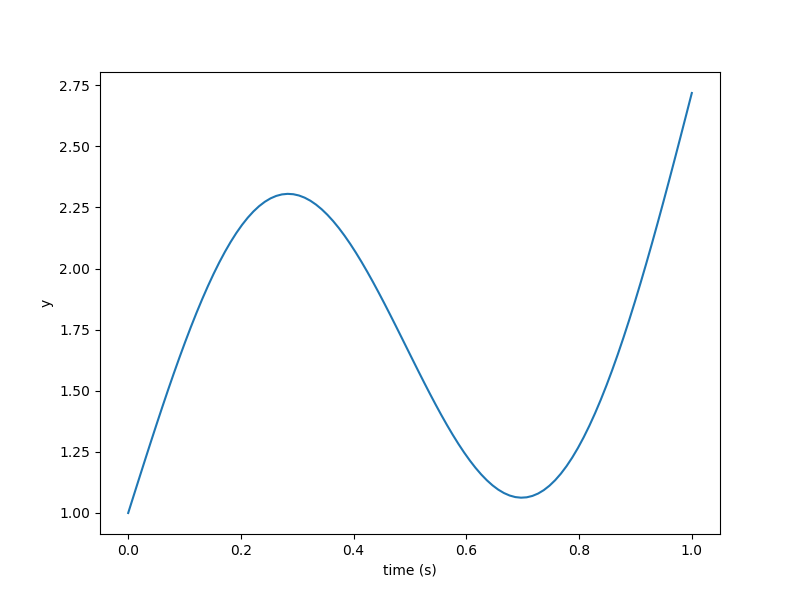

Simple linear ODE
=================

1. ODE system
-------------

.. code-block:: python

  import numpy as np
  
  from openmdao.api import ExplicitComponent
  
  
  class SimpleLinearODESystem(ExplicitComponent):
  
      def initialize(self):
          self.metadata.declare('num_nodes', default=1, type_=int)
  
      def setup(self):
          num = self.metadata['num_nodes']
  
          self.add_input('y', shape=(num, 1))
          self.add_input('t', shape=num)
          self.add_output('dy_dt', shape=(num, 1))
  
          self.declare_partials('dy_dt', 'y', val=np.eye(num))
  
          self.eye = np.eye(num)
  
      def compute(self, inputs, outputs):
          # True solution: e^t + sin(2*pi*t)
          two_pi_t = 2 * np.pi * inputs['t']
          outputs['dy_dt'][:, 0] = inputs['y'][:, 0] + 2 * np.pi * np.cos(two_pi_t) - np.sin(two_pi_t)
  
      def compute_partials(self, inputs, partials):
          two_pi_t = 2 * np.pi * inputs['t']
          partials['dy_dt', 't'] = self.eye \
              * (-(2 * np.pi) ** 2 * np.sin(two_pi_t) - 2 * np.pi * np.cos(two_pi_t))
  

2. ODEFunction
--------------

.. code-block:: python

  import numpy as np
  
  from ozone.api import ODEFunction
  from ozone.tests.ode_function_library.simple_linear_sys import SimpleLinearODESystem
  
  
  class SimpleLinearODEFunction(ODEFunction):
  
      def initialize(self):
          self.set_system(SimpleLinearODESystem)
          self.declare_state('y', 'dy_dt', targets='y')
          self.declare_time(targets='t')
  
      def get_test_parameters(self):
          t0 = 0.
          t1 = 1.
          initial_conditions = {'y': 1.}
          return initial_conditions, t0, t1
  
      def get_exact_solution(self, initial_conditions, t0, t):
          # True solution: C e^t + sin(2*pi*t)
          # outputs['dy_dt'] = inputs['y'] + 2 * np.pi * np.cos(two_pi_t) - np.sin(two_pi_t)
  
          y0 = initial_conditions['y']
          C = (y0 - np.sin(2 * np.pi * t0)) / np.exp(t0)
          return {'y': C * np.exp(t) + np.sin(2 * np.pi * t)}
  

3. Run script and output
------------------------

.. code-block:: python

  import numpy as np
  import matplotlib.pyplot as plt
  from openmdao.api import Problem
  from ozone.api import ODEIntegrator
  from ozone.tests.ode_function_library.simple_linear_func import SimpleLinearODEFunction
  
  ode_function = SimpleLinearODEFunction()
  
  t0 = 0.
  t1 = 1.
  initial_conditions = {'y': 1.}
  
  num = 100
  
  times = np.linspace(t0, t1, num)
  
  method_name = 'RK4'
  formulation = 'solver-based'
  
  integrator = ODEIntegrator(ode_function, formulation, method_name,
      times=times, initial_conditions=initial_conditions,
  )
  
  prob = Problem(integrator)
  prob.setup()
  prob.run_model()
  
  plt.plot(prob['times'], prob['state:y'])
  plt.xlabel('time (s)')
  plt.ylabel('y')
  plt.show()
  
::

  
  =================
  integration_group
  =================
  NL: NLBGS 0 ; 90.2592287 1
  NL: NLBGS 1 ; 12.4892941 0.138371381
  NL: NLBGS 2 ; 5.40902531 0.0599276705
  NL: NLBGS 3 ; 2.54497707 0.0281963086
  NL: NLBGS 4 ; 0.783645137 0.0086821608
  NL: NLBGS 5 ; 0.175877216 0.00194857876
  NL: NLBGS 6 ; 0.0312245941 0.000345943506
  NL: NLBGS 7 ; 0.00461052713 5.10809498e-05
  NL: NLBGS 8 ; 0.00058493123 6.48056978e-06
  NL: NLBGS 9 ; 6.52166781e-05 7.22548587e-07
  NL: NLBGS 10 ; 6.49652087e-06 7.19762507e-08
  NL: NLBGS 11 ; 5.85520053e-07 6.48709347e-09
  NL: NLBGS 12 ; 4.82233488e-08 5.34276102e-10
  NL: NLBGS 13 ; 3.65867769e-09 4.053522e-11
  NL: NLBGS 14 ; 2.57417044e-10 2.85197478e-12
  NL: NLBGS 15 ; 1.68904109e-11 1.87132231e-13
  NL: NLBGS Converged
  

