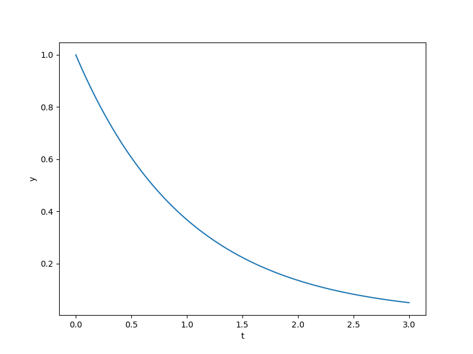

Specifying initial conditions
=============================

When calling :code:`ODEIntegrator`, there are two ways of specifying the initial conditions.

1. Fixed initial conditions
---------------------------

If the initial conditions are fixed, the simplest way to specify them is to pass them in
when calling :code:`ODEIntegrator`:

.. code-block:: python

  import numpy as np
  import matplotlib.pyplot as plt
  
  from openmdao.api import Problem
  
  from ozone.api import ODEIntegrator
  from ozone.tests.ode_function_library.getting_started_ode_func \
      import GettingStartedODEFunction
  
  ode_function = GettingStartedODEFunction()
  formulation = 'solver-based'
  method_name = 'RK4'
  times = np.linspace(0., 3., 101)
  
  # Here, initial_conditions is passed in.
  initial_conditions = {'y': 1.}
  
  integrator = ODEIntegrator(ode_function, formulation, method_name,
      times=times, initial_conditions=initial_conditions)
  
  prob = Problem(model=integrator)
  prob.setup(check=False)
  prob.run_model()
  
  plt.plot(prob['times'], prob['state:y'][:, 0])
  plt.xlabel('t')
  plt.ylabel('y')
  plt.show()
  
.. figure:: specifying_ics_Test_test_fixed.png
  :scale: 80 %
  :align: center

2. Variable initial conditions
------------------------------

If the initial conditions vary during optimization,
they must be connected from an external component:

.. code-block:: python

  import numpy as np
  import matplotlib.pyplot as plt
  
  from openmdao.api import Problem, IndepVarComp
  
  from ozone.api import ODEIntegrator
  from ozone.tests.ode_function_library.getting_started_ode_func \
      import GettingStartedODEFunction
  
  ode_function = GettingStartedODEFunction()
  formulation = 'solver-based'
  method_name = 'RK4'
  times = np.linspace(0., 3., 101)
  
  integrator = ODEIntegrator(ode_function, formulation, method_name,
      times=times)
  
  # Below, the initial condition is connected from an external component.
  prob = Problem()
  prob.model.add_subsystem('initial_conditions_comp', IndepVarComp('y0', 1.))
  prob.model.add_subsystem('integrator_group', integrator)
  prob.model.connect('initial_conditions_comp.y0', 'integrator_group.initial_condition:y')
  prob.setup(check=False)
  prob.run_model()
  
  plt.plot(prob['integrator_group.times'], prob['integrator_group.state:y'][:, 0])
  plt.xlabel('t')
  plt.ylabel('y')
  plt.show()
  

